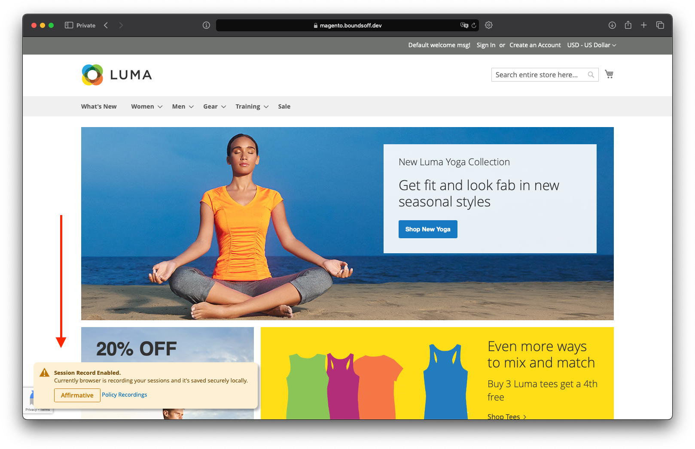
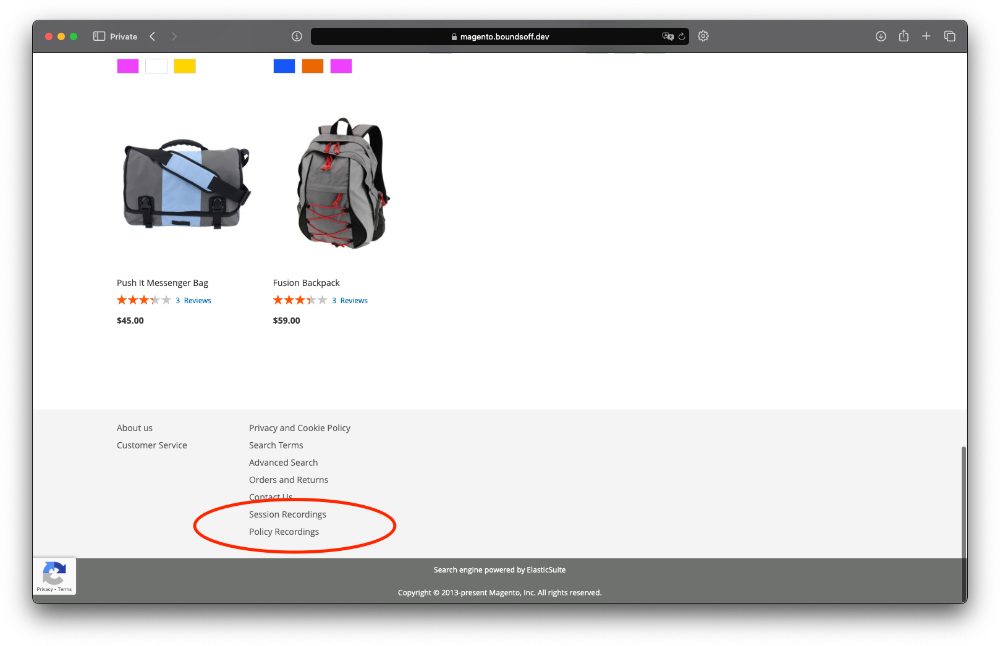
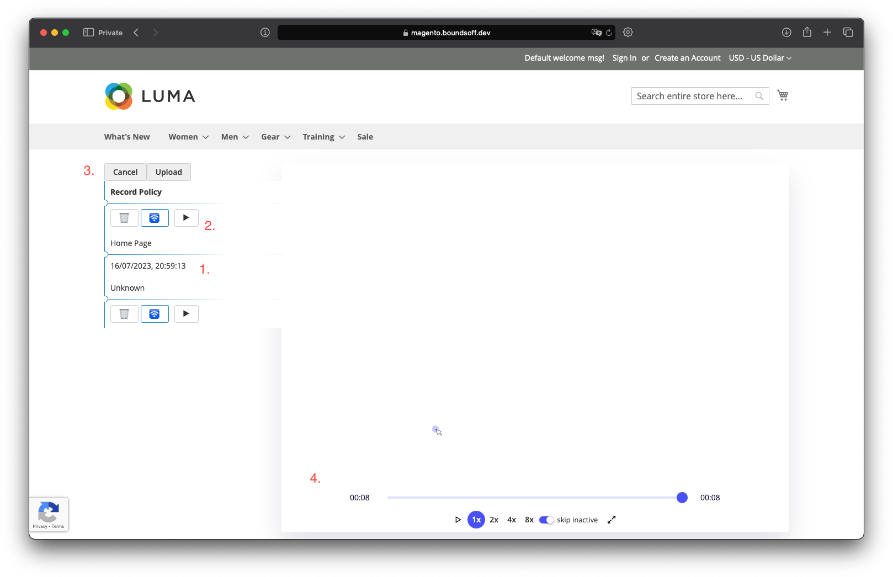
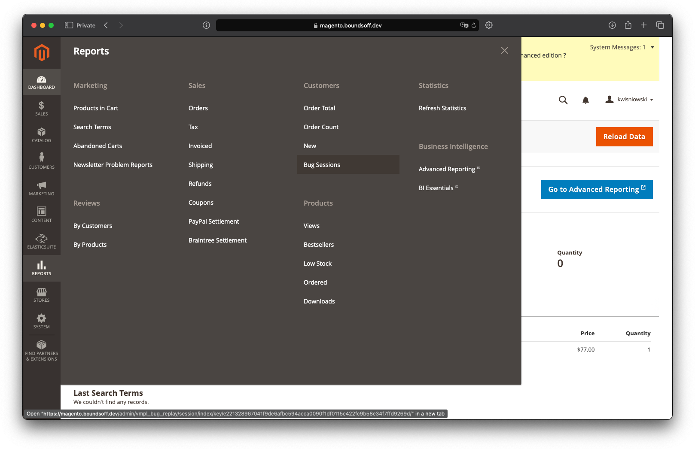
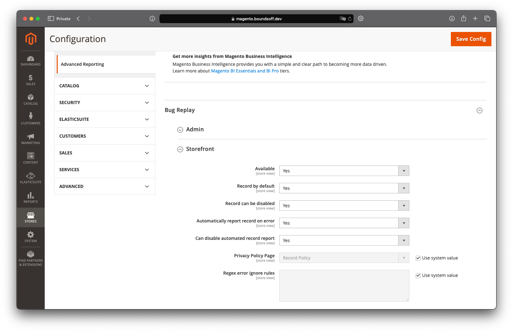

# Feature guide
* All session recoding data is saved directly into the browser memory using [IndexedDB](https://developer.mozilla.org/en-US/docs/Web/API/IndexedDB_API)
* All operations for saving the information are done withing in the background using [WebWorker](https://developer.mozilla.org/en-US/docs/Web/API/Web_Workers_API/Using_web_workers)
* If enabled, the last recorded session with error can be reported automatically or by user prompt
* Reported session can be listed and replayed in the admin

## Storefront
### Dialog Messages
There are a couple of dialog messages that can be shown in the screenshot bellow:
1. *Default enabled* - shows on startup if recording is enabled by default
2. *Not Caught* - shows when error was detected but recording wasn't enabled
3. *Error Detected* - shows when previous session got error recorded and is available for preview and send it
4. *Report Send* - shows after chosen session ware uploaded to the backend

### Footer links
There are two links that provide with the following pages:
1. *Policy* - here content for term is used to inform user what's and where is recorded with buttons to toggle those features 
2. *Sessions* - here is the page that can manged session recordings

### Session player
1. One of the Session recordings, one click to choose and hold it to display more options
2. Options with delete and play, with middle one for selection to upload
3. Upload prompts buttons for chosen recording can be multiple
4. Player for given session

## Adminhtml
### Uploaded session recordings
List of uploaded sessions can be found in image bellow, each of them can be replayed

### Store Configuration
Bellow is the image that settings for bug replay are placed with the following:
1. *Available* - when given module should be available for using, it stills loads files, but it can't record on its own
2. *Record by default* - when it's set the recording will be enabled by default for new users
3. *Record can be disabled* - this allows users to disable session recording on privacy page
4. *Automatically report record on error* - when enabled then previos session with error will be uploaded automatically
5. *Can disable automated record report* - this allows users to disable an automated report on privacy page
6. *Privacy Policy Page* - settings for privacy page content
7. *Regex error ignore rules* - list of regex separated by new line which are used to filter out errors with a given message

